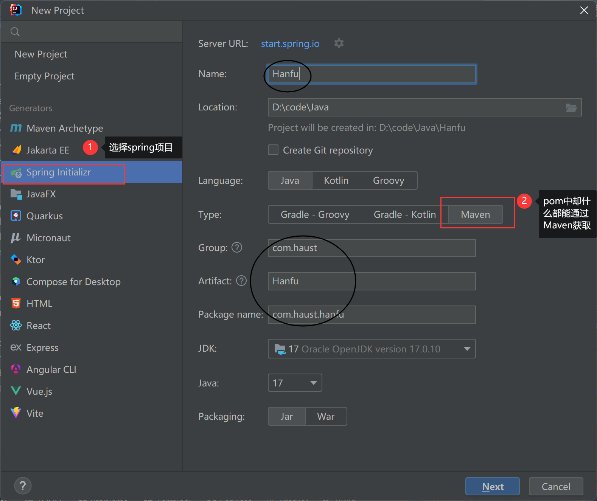
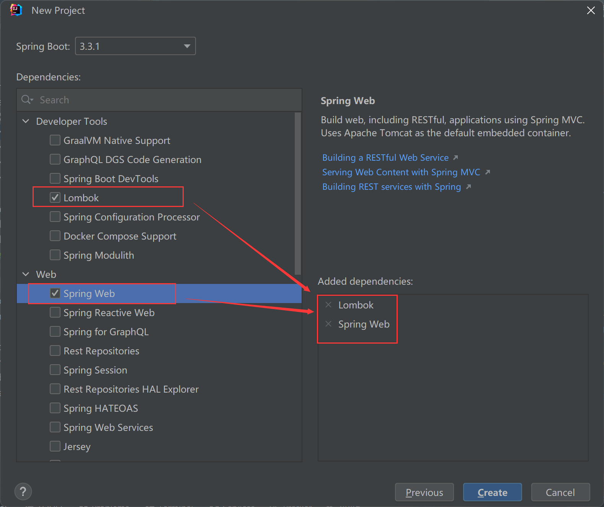
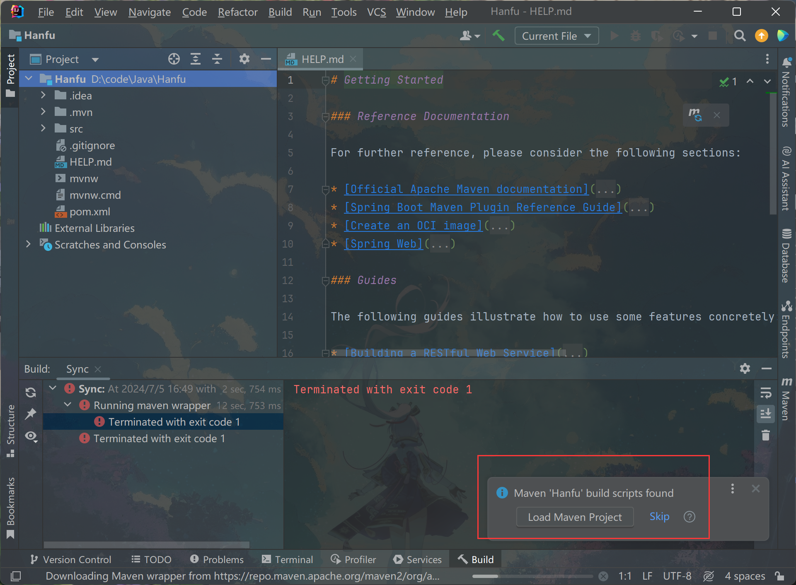
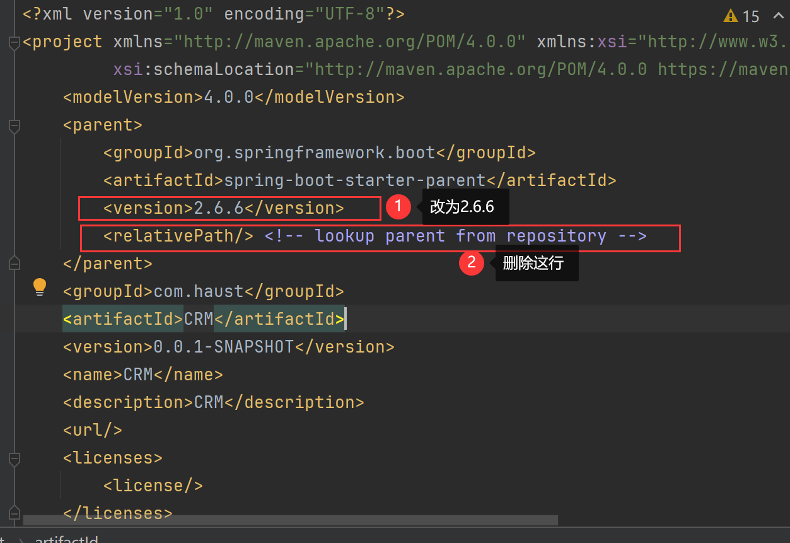
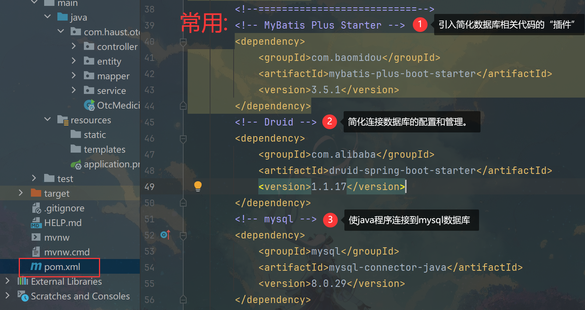
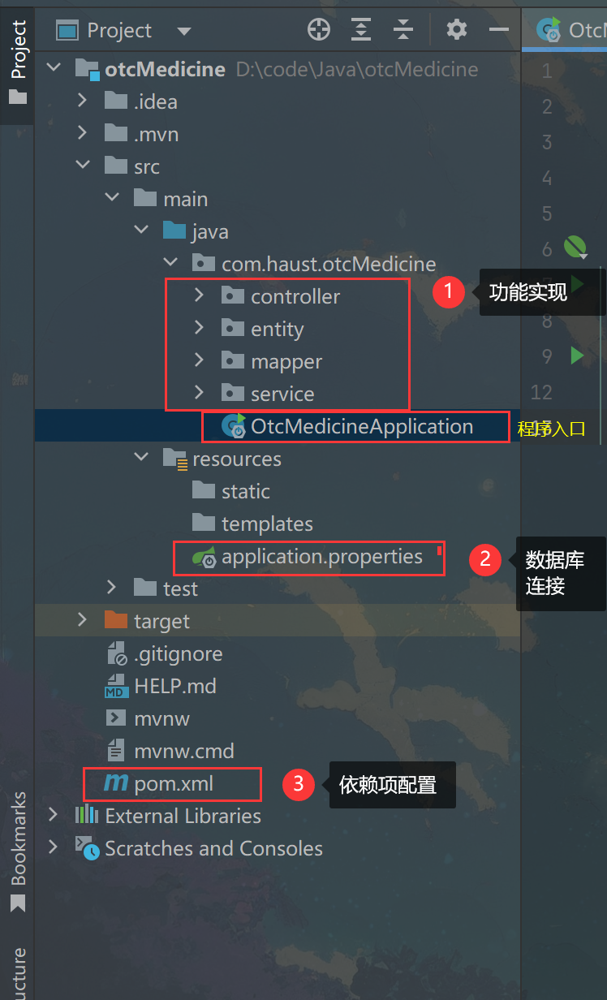
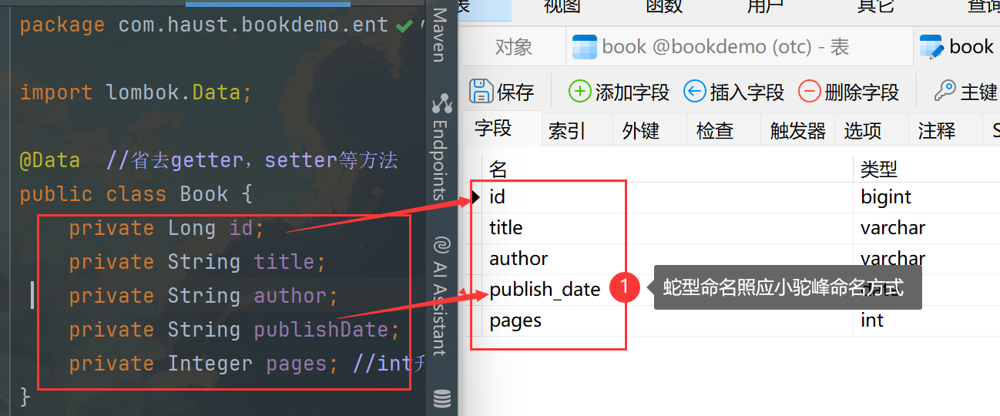
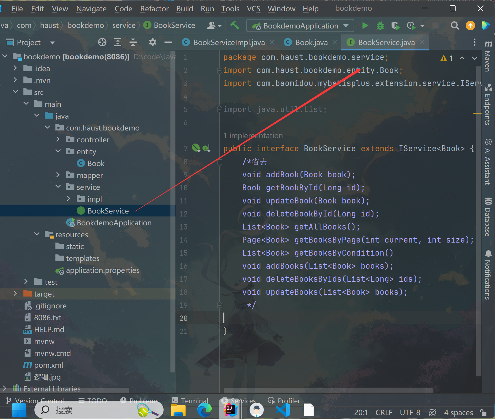
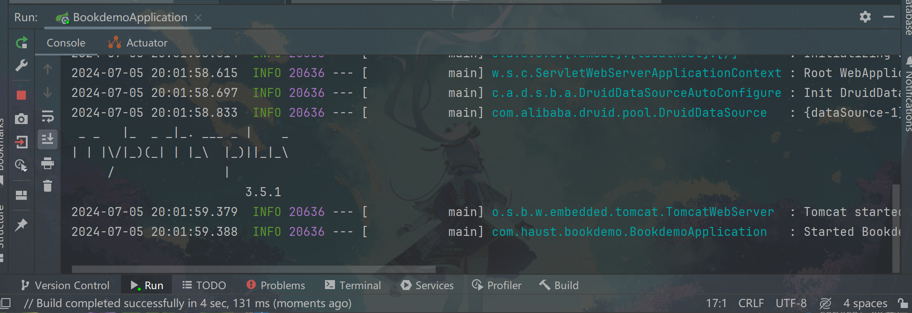

# springboot项目创建  

## 1.项目创建
  
  

 **创建后进入页面，点击load加载Maven配置**
  

 **创建成功！**

## 2.依赖项下载
 
 

添加后点击悬浮的刷新按钮进行下载

 ## 3.文件内容
 

 ### 3.1 主体
 >entity：实体。定义每一个模块的变量名（名称需要与数据库中的属性名称照应）。
 >
 >

 >service：业务层，所有的内部的业务逻辑都会放在这里处理，比如用户的增删改查，或者发送个验证码或邮件。但service里只写出函数名，具体在serviceimpl中实现。这样前端可以只查阅这个就知道有哪些功能。
 >
 > 

>mapper：数据持久化层，就是和数据库打交道的。

>controller：业务控制，架起外界与业务层沟通的桥梁，前端在调用接口访问相关业务时，都会由Controller去调相关的业务层代码并把数据返回给前端。

## 4.运行
下面出现两行与上面隔开表示成功运行！

