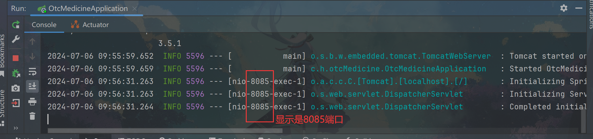
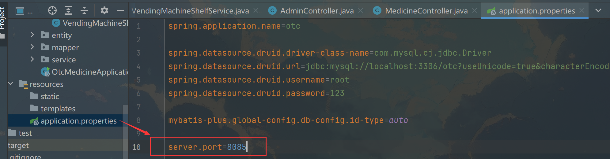
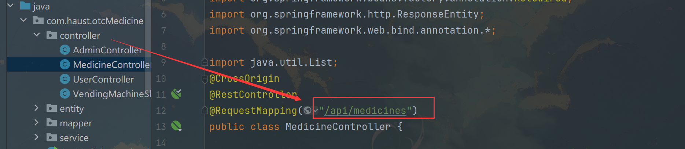
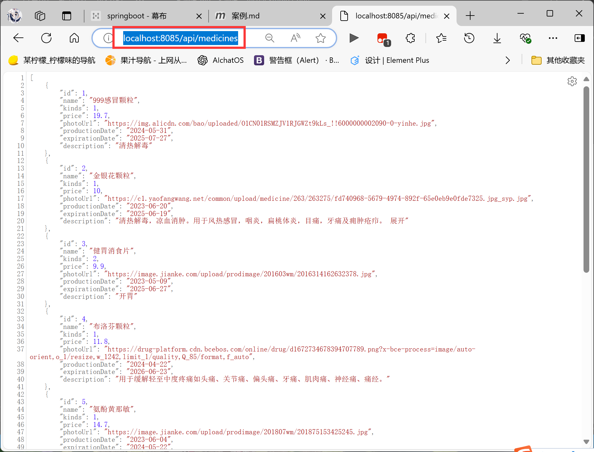
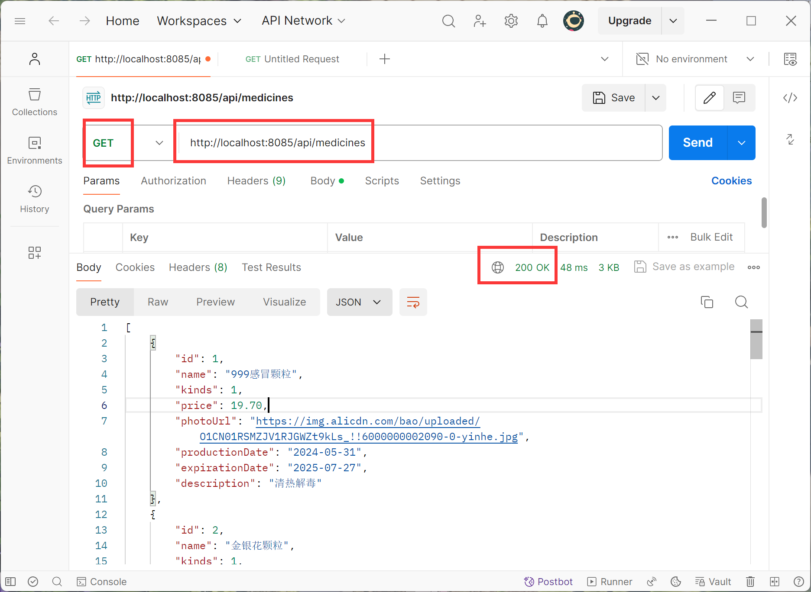
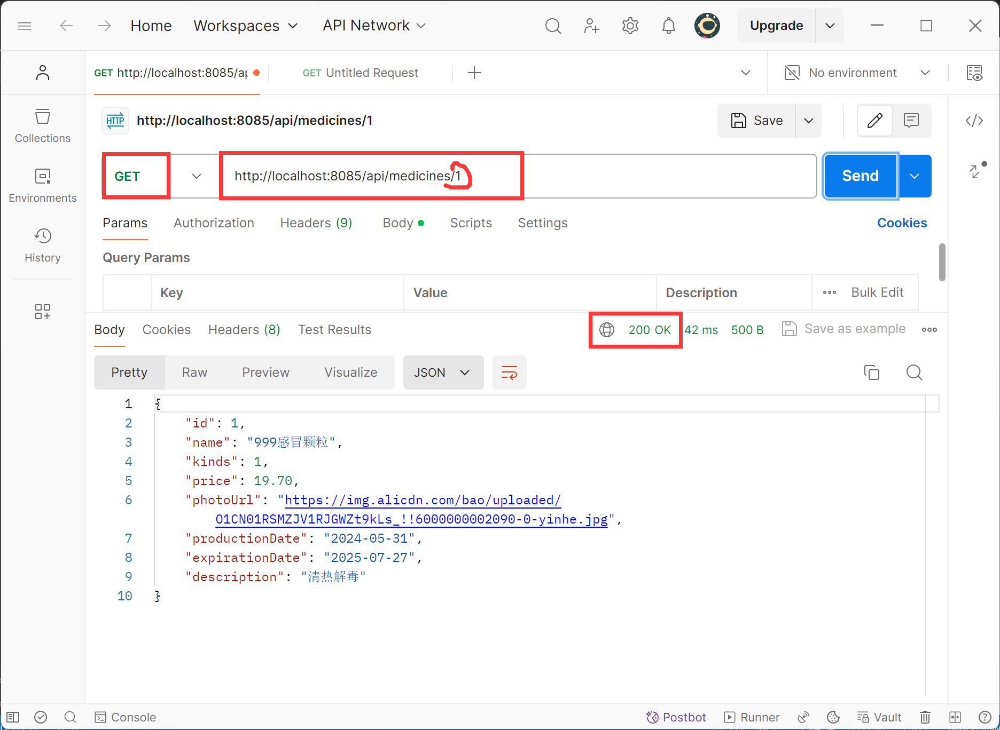
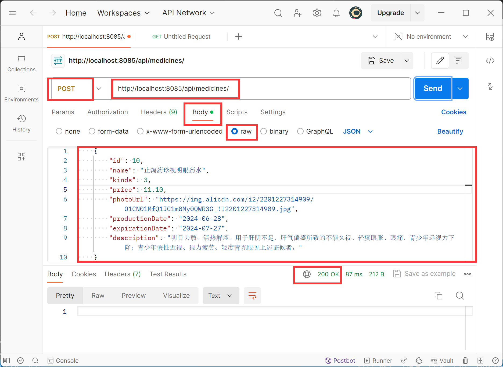
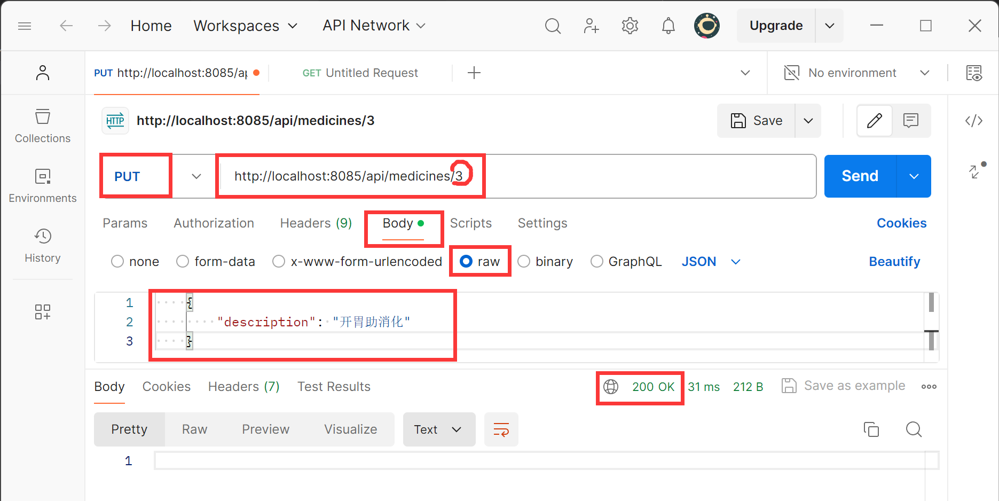
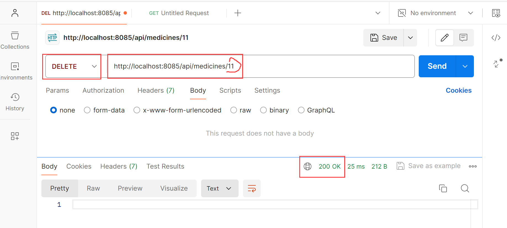

# 一.确定基础url
#### 1.在运行结果或application.properties里确定端口号，

#### 2.在controller里查看具体url

# 二.在浏览器直接浏览
本质上是调用了get请求，获取了所有信息。

# 三.postman测试
测试后端controller里的请求是否能正常执行，这样前端出问题后就能确定是后端还是前端代码出现错误。
## 1.get所有

## 2.get by id

## 3.post（增）

## 4.put(改)
只需要输入想改的属性名和属性值

## 5.delete

